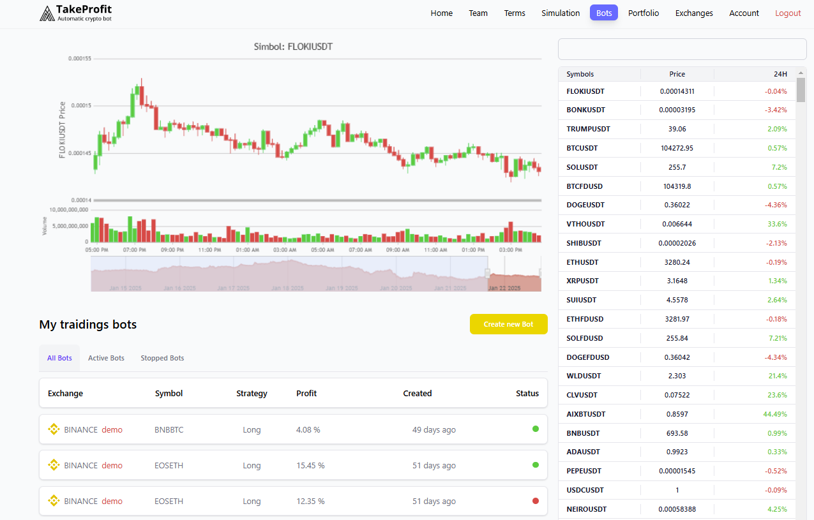

# TakeProfit — Automatic Crypto Bot (Team Project) | Showcase

This repository is a **public showcase** of the TakeProfit project built during AIT training.  
The original deployed website is **offline** (domain was not renewed), so this repo preserves:
- screenshots
- feature overview
- my contribution

---

## Project summary
**TakeProfit** is a fullstack web application for automated crypto trading workflows.

- Frontend: React + TypeScript + Vite
- Backend: Java + Spring Boot
- Team size: 5 (developers + QA)
- Delivery style: Git workflow, code reviews, team collaboration

---

## Key features (high level)
- Authentication & user flows
- Trading dashboard UI (charts, modes, status)
- Admin / management pages
- API-driven architecture (frontend ↔ backend)

---

## My contribution
- Implemented frontend pages/components and API integration
- Participated in team development process (branches, PRs, reviews)
- Worked closely with QA and backend teammates

---

## Source code
The full source code is kept in private repositories (available on request):
- Frontend: https://github.com/IngaPal/takeprofit-frontend
- Backend: https://github.com/IngaPal/takeprofit-backend

(Available on request.)
